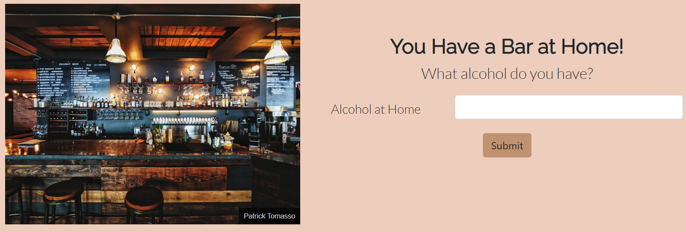
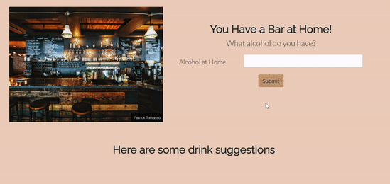

# Bar At Home

It's safer to drink in the comfort of your own home.

Bar At Home can help with that as it allows users to enter the alcohol they have on hand and drink list populates.

Link to project: https://bar-at-home.netlify.app/

## Screenshots

## Demo

## Tech Stack

HTML, CSS, VanillaJS, Bootstrap, Moqups, Netlify

I created the design using Moqups. I used the design to complete the HTML and CSS code using Bootstrap.
I then implemented the Javascript functionality to fetch from The Cocktail API Database. 
I deployed the site using Netlify.

## Optimizations

I would like to work on the design of the site more. It is quite plain.
I would also like to make it so the user can also be able to favorite any drinks they made and liked.
I want the site to also display the ingredients needed to make the drink and the directions all on one page.

